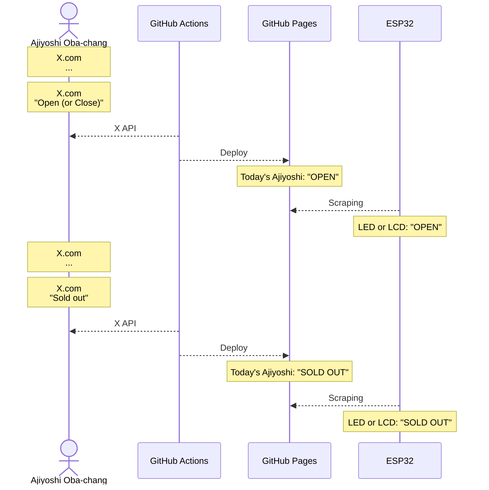

# CONTRIBUTING.md

## Overview

## dir: `script`

X APIを叩いてツイートを取得するためのPythonスクリプト群。

1. 昼過ぎに`get_posts.py`を実行して[あじよし公式X](https://x.com/ajiyoshiver2)の直近10件の投稿を取得
2. `filter_posts.py -1`を実行して今日の投稿だけを抽出
3. `check_openclose.py`を実行して営業状況を判定
4. 開店している場合、夜に`get_posts.py` `filter_posts.py -2` `check_soldout.py`を実行して売り切れかどうかを調べる

判定は投稿に特定のワードが含まれているか否かで行われ、`data/result.txt`が更新されるとともに`gh-actions`ブランチからGitHub Pagesにデプロイされる。

| 状況      | `data/result.txt`の値 | 判定ワード    |
|:---------:|:---------------------:|:-------------:|
| CLOSE     | 0                     | 「お休み」    |
| OPEN      | 1                     | 「メニュー」  |
| SOLD OUT  | 2                     | 「完売」      |

> [!NOTE]
> - X APIの無料枠では月に100件のリクエストが可能
> - 一度にリクエストできる件数は**10以上**100未満
> 
> 以上の制約により懐を痛めずに毎日X APIを叩くことは不可能であるため、以下のような工夫によってリクエスト回数をケチることが求められる。
>
> - 基本的に土日は営業していないのでリクエストしない
> - 一度目（昼過ぎ）のリクエストで営業していないと判った場合、その日は二度目のリクエスト（夜）をしない

## dir: `src`

マイコンからGitHub Actionsによって更新された`data/result.txt`を読み取り、LEDやLCDに反映するためのファームウェア。
 
## TODO

### esp32によるスタンドアロン化

- 更新された`data/result.txt`内の値をWi-Fi経由で参照し、LEDやLCDなどのハードウェアで表示したい

> [!NOTE]
> 別段ESP32に拘る理由は無いが、Wi-Fiが使えて安価かつドキュメントが豊富なデバイスとして[ESP-WROOM-02](https://akizukidenshi.com/catalog/g/g112236/)が適当ではないかと考えられる。