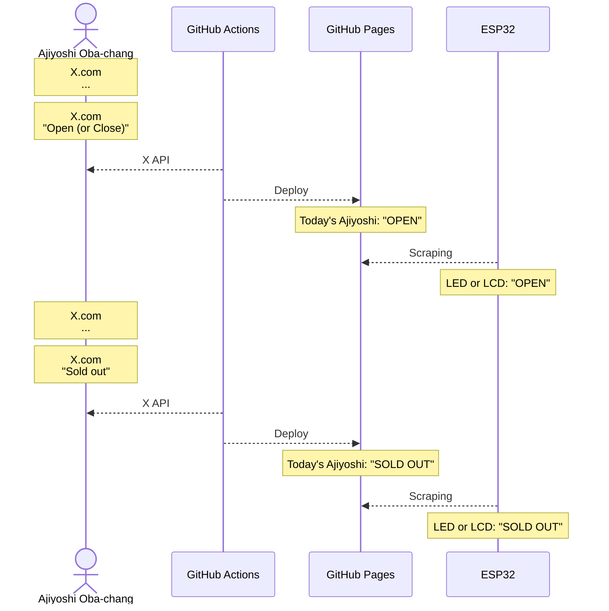

# CONTRIBUTING.md

*「あじよし今日やってんのかな…」*

## Overview

## TODO

### branch: `gh-actions`

- GitHub Actionsで諸々をサーバーレスに動かす
- X APIで[おばちゃんのXへの投稿](https://x.com/ajiyoshiver2)を取得して、その日の営業状況に関する情報だけを抽出
- GitHub Pagesに営業状況をデプロイするとともに、`data/result.txt`内の値を以下の表に従って更新

| 状況      | 値 | 判定ワード   |
|:---------:|:--:|:------------:|
| CLOSE     | 0  | 「お休み」   |
| OPEN      | 1  | 「メニュー」 |
| SOLD OUT  | 2  | 「完売」     |

> [!NOTE]
> - X APIの無料枠では月に100件のリクエストが可能
> - 一度にリクエストできる件数は**10以上**100未満
> 
> 以上の制約により懐を痛めずに毎日X APIを叩くことは不可能であるため、以下のような工夫によってリクエスト回数をケチることが求められる。
>
> - 基本的に土日は営業していないのでリクエストしない
> - 一度目（昼過ぎ）のリクエストで営業していないと判った場合、その日は二度目のリクエスト（夜）をしない
 
### branch: `esp32`

- 更新された`data/result.txt`内の値をWi-Fi経由で参照し、LEDやLCDなどのハードウェアで表示
- マイコンから直接X APIを叩くのは荷が重い

> [!NOTE]
> 別段ESP32に拘る理由は無いが、Wi-Fiが使えて安価かつドキュメントが豊富なデバイスとして[ESP-WROOM-02](https://akizukidenshi.com/catalog/g/g112236/)が適当ではないかと考えられる。