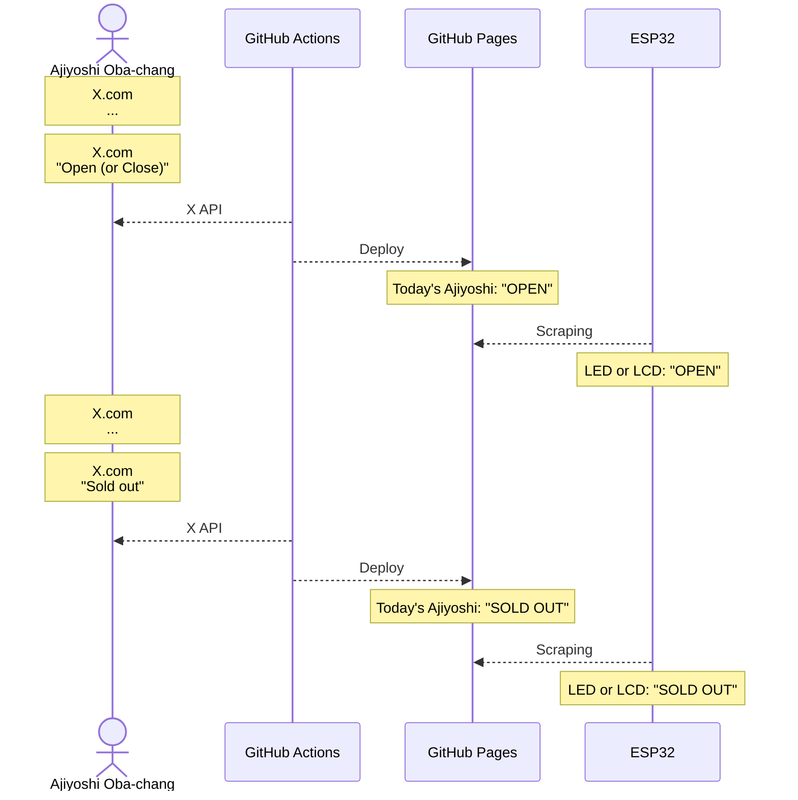

# CONTRIBUTING.md

*「あじよし今日やってんのかな…」*

## Overview

## TODO

### branch: `x-api`

- 定刻にX APIで[おばちゃんのXへの投稿](https://x.com/ajiyoshiver2)を取得して、その日の営業状況に関する情報だけを抽出
- GitHub ActionsでGitHub Pagesに営業状況をデプロイするとともに、リポジトリ内のtxtファイルの数字を以下の表に従って更新

| 状況      | 値 |
|:----------|:--:|
| OPEN      | 1  |
| CLOSE     | 0  |
| SOLD OUT  | 2  |

#### 留意事項

- X APIの無料枠では月に100件のリクエストが可能
- 一度にリクエストできる件数は**10以上**100未満

以上の条件から懐を痛めずにX APIを毎日リクエストすることは不可能であるため、以下のような工夫によってリクエスト回数をケチることが求められる。

- 土日は確実に営業していないのでリクエストしない
- 一度目（昼過ぎ）のリクエストで営業していないと判った場合、その日は二度目のリクエスト（夜）をしない

### branch: `esp32`

- 更新されたリポジトリ内のtxtファイルをWi-Fi経由で参照し、営業状況をLEDやLCDなどのハードウェアで表示

#### 留意事項

別段ESP32に拘る理由は無いが、Wi-Fiが使えて安価かつドキュメントが豊富なデバイスとして[ESP-WROOM-02](https://akizukidenshi.com/catalog/g/g112236/)が適当ではないかと考えられる。